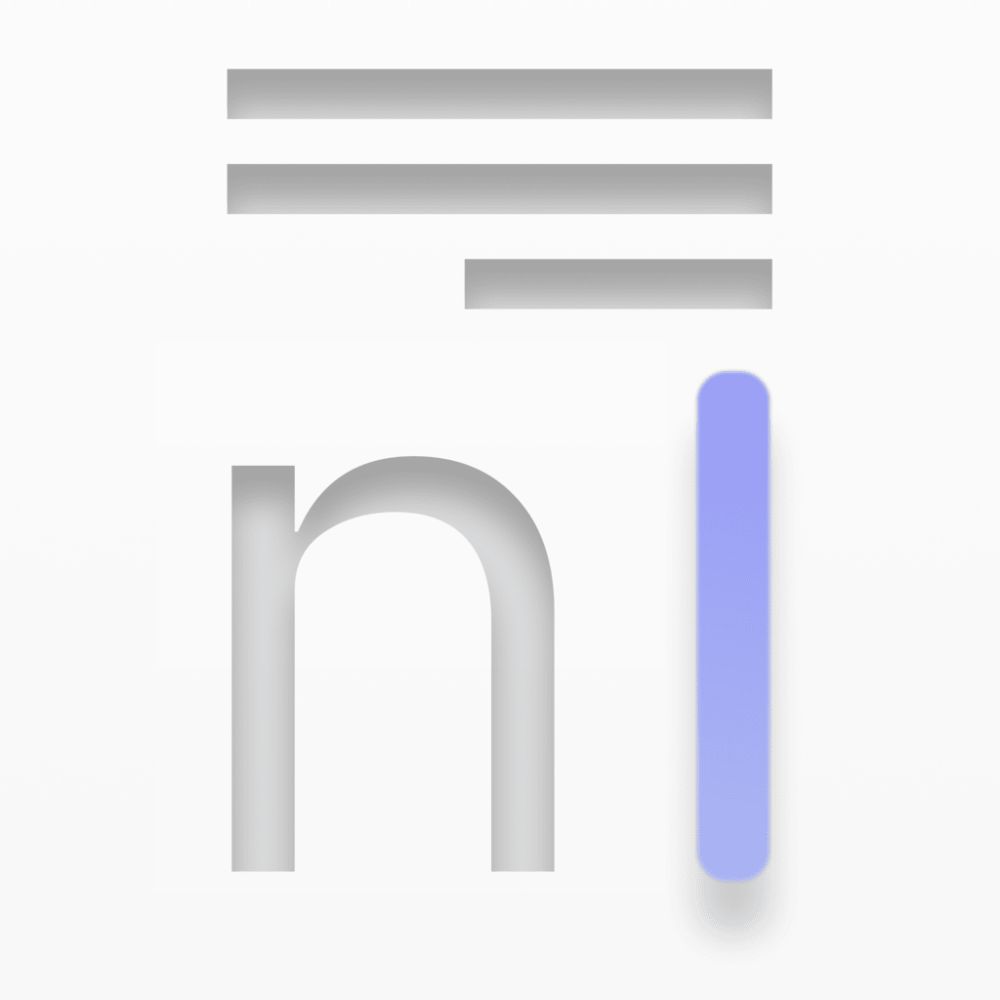
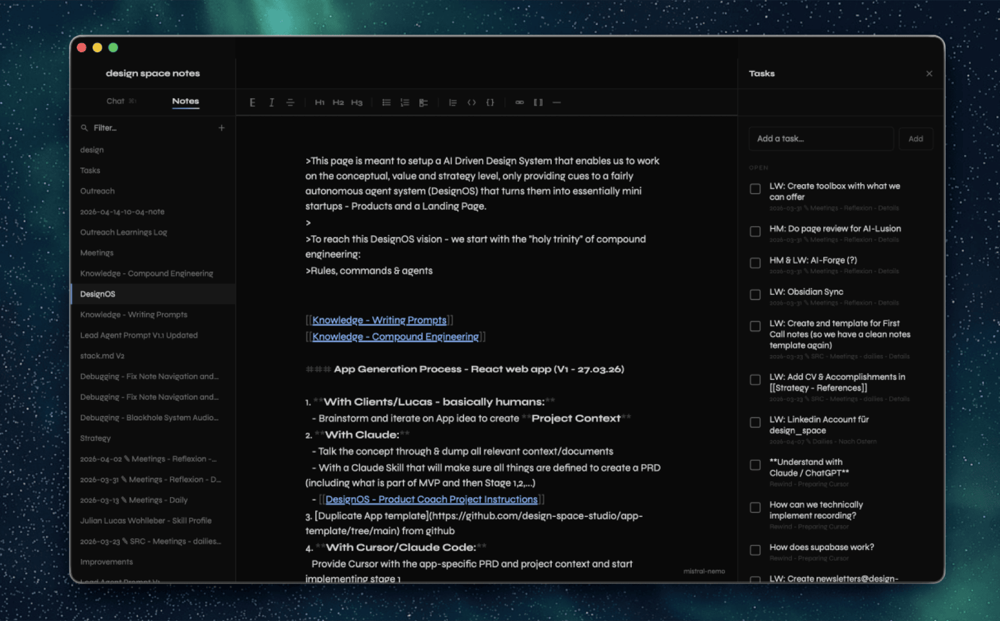

<p align="center">
  
</p>

<h1 align="center">Note_</h1>

<p align="center"><em>A local-first notes app for macOS.</em></p>

<p align="center">
  
</p>

Note_ is an Obsidian-compatible Markdown editor that keeps a small AI model on your Mac and points it at your vault. Search, chat and summarisation happen locally — no cloud, no keys.

- Plain `.md` files on disk. Your vault stays yours.
- Wikilink editor with `[[note]]` autocomplete.
- Whole-vault retrieval index, rebuilt incrementally in the background.
- Chat against your notes through a local Ollama model.
- Tasks panel surfaces every `- [ ]` line, wherever it lives.

## Install

Download the DMG from the [latest release](https://github.com/JulianWohlleber/CL-Note/releases/latest), drag `Note_.app` onto the `Applications` shortcut, and launch it.

On first launch Note_ sets everything up in-app:

1. Pick a vault folder.
2. Detect Ollama — or take you to install it in one click.
3. Choose a model from a curated list (1.3 GB → 9.1 GB, with RAM guidance).
4. Stream the model down with live progress.

No terminal, no `curl … | sh`, no picking model names off a wiki.

## Build from source

```sh
./build.sh && open Note_.app
```

Requires macOS 13+ and Swift 5.9. Chat requires [Ollama](https://ollama.com) reachable on `localhost:11434`.

## How it works

- **Editor** — a `SwiftUI`-hosted `NSTextView` with a custom `NSTextStorage` that resolves `[[wikilinks]]` in place as the user types.
- **Retrieval** — a JSON-on-disk vault index rebuilt incrementally in the background. Only files whose mtime or size changed since the last scan are re-read.
- **Chat** — the top-K ranked notes are inlined into a strict citation-required prompt and sent to Ollama's local `/api/chat`. Sources are deduplicated by file and returned alongside the answer.
- **Setup** — a first-run wizard that pulls Ollama install and model selection inside the app instead of the terminal. Streaming `/api/pull` progress is aggregated per layer so the bar never regresses.

## Curated models

| Tag | Display | Disk | RAM |
|---|---|---|---|
| `llama3.2:1b` | Llama 3.2 1B | 1.3 GB | 4 GB |
| `llama3.2:3b` | Llama 3.2 3B | 2.0 GB | 8 GB |
| `phi3.5` | Phi 3.5 Mini | 2.2 GB | 8 GB |
| `qwen2.5:7b` | Qwen 2.5 7B | 4.7 GB | 16 GB |
| `gemma2:9b` | Gemma 2 9B | 5.4 GB | 16 GB |
| **`mistral-nemo`** | **Mistral Nemo 12B** | **7.1 GB** | **16 GB** |
| `phi4` | Phi-4 14B | 9.1 GB | 32 GB |

Mistral Nemo is the recommended default: 128k context is comfortable for long note threads and reasoning stays balanced across sources.

## License

MIT
